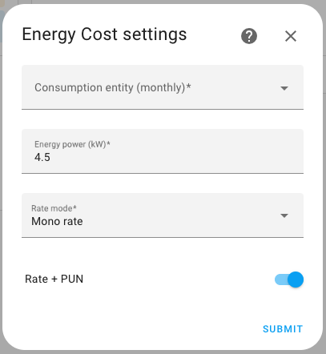
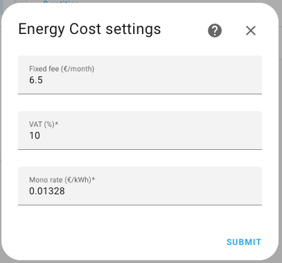
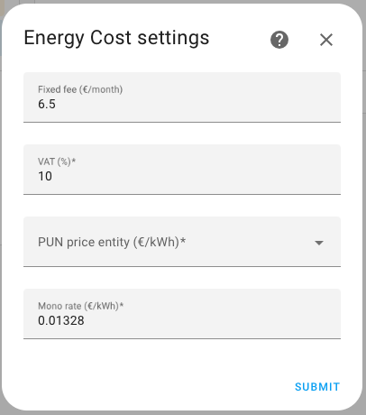
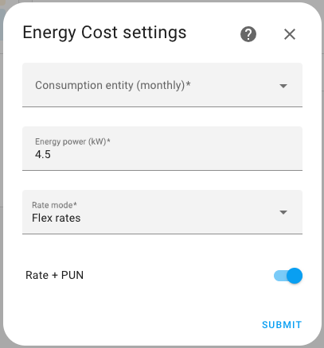
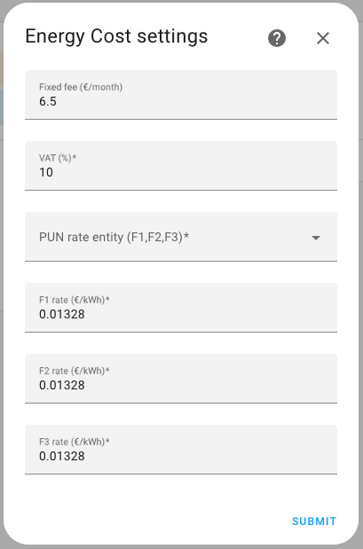
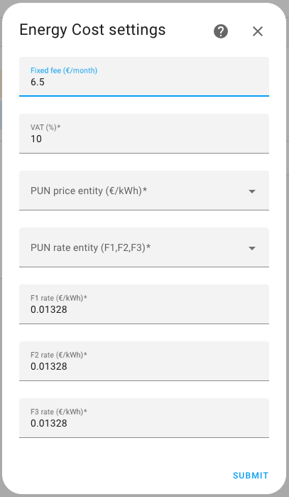
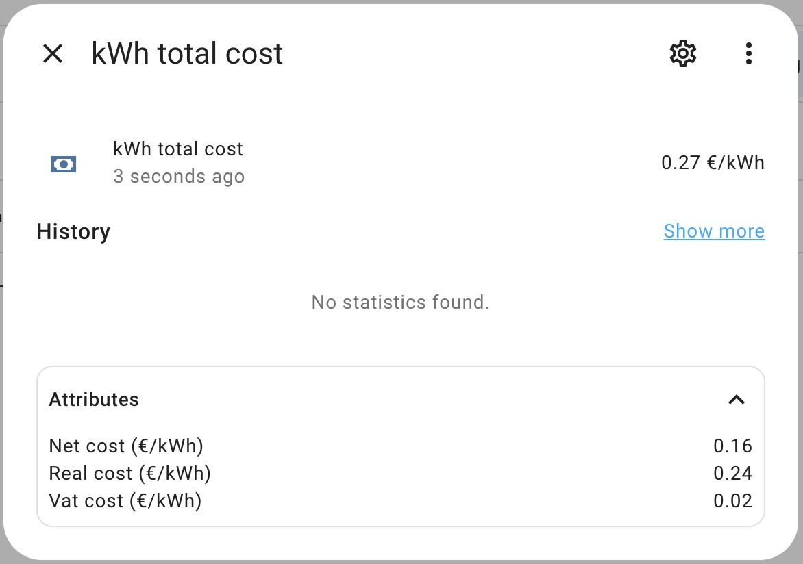
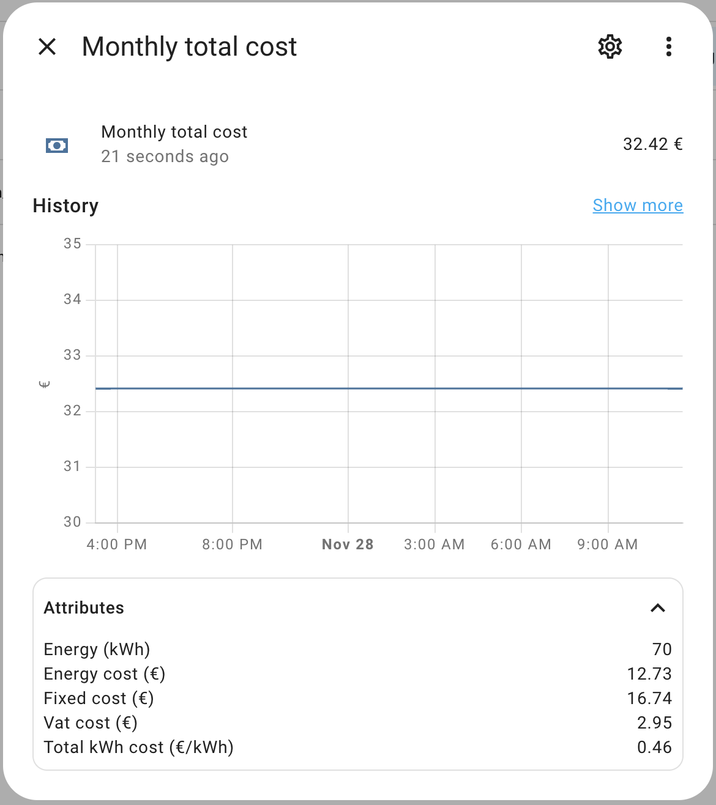

# HomeAssistant - Energy cost
## Requisite
- A sensor that expose the current month power consuption (kWh);

For "Flex rates":
- A sensor that expose the current rate (F1, F2, F3), like "**sensor.pun_fascia_corrente**" from [Prezzi PUN del mese](https://github.com/virtualdj/pun_sensor);

For "PUN" based rate/rates:
- A sensor that expose the current rate price (€/kWh), like "**sensor.pun_prezzo_fascia_corrente**" from [Prezzi PUN del mese](https://github.com/virtualdj/pun_sensor);

## Installation

### Using [HACS](https://hacs.xyz/)
1. Go to HACS section;
2. From the 3 dots menu (top right) click on **Add custom repository**;
3. Add as **Integration** this url https://github.com/andreadegiovine/homeassistant-energy-cost;
4. Search and install **Energy cost** from the HACS integration list;
5. Add this integration from the **Home Assistant** integrations.

### Manually
1. Download this repository;
2. Copy the directory **custom_components/energy_cost** on your Home Assistant **config/custom_components/energy_cost**;
3. Restart HomeAssistant;
4. Add this integration from the **Home Assistant** integrations.

## Configuration

### Mono rate

#### Mono rate fixed

#### Mono rate + PUN

In this case the "Mono rate" field contain the extra charge price on PUN base price.

### Flex rates

#### Flex rates fixed

#### Flex rates + PUN

In this case "F1 rate", "F2 rate" and "F3 rate" fields contains the extra charge price on PUN base price.

# Result

## Sensor "kWh total cost"

Total kWh cost including all costs and taxs.

"Net cost" = energy cost.

"Real cost" = energy cost + management costs.

## Sensor "Monthly total cost"

Current month total cost including all costs and taxes.

"Total kWh cost" = monthly total cost / energy

## Support the project
